Atari Pong è un gioco nel quale una pallina si muove tra due racchette verticali e il giocatore controlla una delle racchette muovendosi verticalmente. L'obiettivo è intercettare la pallina e indurre l'avversario, controllato dalla CPU, a mancarla, così da segnare un punto. La partita termina quando uno dei due giocatori raggiunge per primo un punteggio prefissato (11 punti [^4]). Pubblicato da Atari nel 1972, Pong fu uno dei primi grandi successi commerciali dell'industria videoludica e contribuì in modo decisivo alla diffusione dei videogiochi.

In questo progetto viene studiato l'impiego del reinforcement learning per apprendere una policy capace di giocare ad Atari Pong. La Deep Q-Network (DQN) che useremo fu presentata inizialmente da Mnih et al. nel 2013 [7] e successivamente consolidata nel lavoro pubblicato su Nature nel 2015 [1], che ne estese la valutazione a 49 giochi Atari. Quel lavoro mostrò che una singola architettura, addestrata end-to-end a partire dai pixel e dal reward di gioco, poteva apprendere policy competitive su un ampio insieme di giochi Atari, raggiungendo spesso prestazioni superiori al benchmark umano.

La base del progetto è una DQN implementata in PyTorch, senza componenti pre-addestrate, che riprende la struttura convoluzionale del sopracitato lavoro di Mnih et al. [1] adattando lo strato di output allo spazio d'azione ridotto di Pong. La baseline viene confrontata con Double DQN [2] e con quattro famiglie di varianti sperimentali, con l'obiettivo di approfondire l'influenza che la costruzione del target TD, la schedule di esplorazione e l'introduzione di reward ausiliari possono avere sull'apprendimento.

Nello specifico, l'ablation dell'esplorazione confronta schedule lineare, esponenziale e costante, mentre lo studio del reward shaping considera un bonus legato alla durata del rally, un Potential-Based Reward Shaping (PBRS) e un bonus associato al contatto tra pallina e racchetta, ciascuno valutato a diversi livelli di intensità.

## 2. Contributo

Il progetto si basa su metodi consolidati in letteratura, in particolare DQN [1], Double DQN [2] e Potential-Based Reward Shaping [3]. A questi vengono affiancate varianti sperimentali sulla schedule di esplorazione $\varepsilon$-greedy e due forme euristiche di reward shaping, basate rispettivamente sulla durata del rally e sul contatto tra pallina e racchetta. Il contributo consiste nel confronto sperimentale controllato dei metodi e delle varianti attraverso un protocollo comune. 

## 3. Data (ambiente)

A differenza di un problema supervisionato, come ad esempio la classificazione di immagini, nel reinforcement learning non si utilizza un dataset statico diviso in training, validation e test set.
In questo paradigma i dati vengono generati online dall'interazione dell'agente con l'ambiente, nel nostro caso `ALE/Pong-v5`, cioè la versione di Pong resa disponibile tramite Gymnasium. ALE riproduce la dinamica della console Atari e permette all'agente di interagire con il gioco mediante azioni discrete ricevendo in risposta i frame dello schermo e il reward prodotto dall'ambiente.

Ad ogni passo Gymnasium restituisce quindi l'osservazione successiva, il reward e due segnali distinti che descrivono la conclusione dell'episodio. `terminated=True` (equivalente al game over) indica che è stato raggiunto uno stato terminale e non esiste un valore futuro da propagare, quindi il termine di bootstrap viene annullato. `truncated=True` indica invece che l'episodio è stato interrotto da una condizione esterna (il limite temporale dell'ambiente) e non equivale quindi ad uno stato terminale del gioco, cioè il valore dello stato successivo va ancora considerato nel target. In entrambi i casi il codice avvia un nuovo episodio, ma conserva nel replay buffer soltanto il flag `terminated` per distinguere il bootstrap [4].

In generale una transizione può essere rappresentata come

$$  
\tau_t =  
(s_t,a_t,r_t,s_{t+1},\text{terminated}_t,\text{truncated}_t)  
$$

La distribuzione delle transizioni non è fissa, ma cambia durante l'addestramento perché dipende dalla policy $\varepsilon$-greedy corrente e quindi dai parametri della rete. Le transizioni usate per l'ottimizzazione vengono conservate in un replay buffer e campionate uniformemente in minibatch.
Il reward Atari originale è definito da

$$  
r_t^{\mathrm{Atari}}=  
\begin{cases}  
+1 & \text{punto vinto}\\  
-1 & \text{punto perso}\\ 
0 & \text{altrimenti} 
\end{cases}  
$$

Negli esperimenti di reward shaping vengono definiti dei reward di training modificati ma la metrica usata per valutare le policy rimane sempre il reward Atari originale. 

## 4. Esperimento

### 4.1 Architettura e scelte sperimentali

La pipeline comune adotta il wrapper `AtariPreprocessing` e le seguenti scelte architetturali che motiviamo nel seguito

- Esecuzione di no-op iniziali (`noop_max=30`): all'inizio di ciascun episodio l'ambiente esegue un numero casuale di azioni nulle (compreso tra 1 e 30). Questa procedura introduce stocasticità nelle condizioni iniziali favorendo la generalizzazione su traiettorie differenti. Mnih et al. [1] la usano nella valutazione della DQN per ridurre il rischio di sovradattamento a una partenza fissa.
    
- Frame skip (`frame_skip=4`): anziché elaborare ogni singolo fotogramma la medesima azione scelta dall'agente viene ripetuta per 4 passi interni consecutivi della console. Questa scelta riduce di quattro volte il carico computazionale della rete neurale e si è rivelata utile per completare il training in tempi ragionevoli.  Inoltre per uno stesso intervallo di gioco il reward deve così essere propagato attraverso meno decisioni, semplificando in teoria l'attribuzione del credito.
    
- Max-pooling sui due frame più recenti: l'hardware dell'Atari 2600 era soggetto a limitazioni grafiche che costringevano gli sviluppatori a ricorrere al flickering (sfarfallio), cioè proiettare gli sprite (pallina, racchette) a frame alterni. Il massimo pixel per pixel tra gli ultimi due frame riduce il rischio che uno sprite scompaia dall'osservazione per effetto di questo campionamento temporale.
    
- Immagini in scala di grigi e resize a $84\times84$: semplificano lo spazio delle feature rimuovendo informazioni cromatiche superflue per il gameplay e riducendo la dimensionalità dei dati.
    
- Azione `FIRE` al reset: in Pong, dopo il reset o la perdita di un punto, il gioco rimane bloccato in attesa che il giocatore prema il pulsante di servizio. L'invio automatico del comando `FIRE` garantisce l'avvio immediato dello scambio, evitando che l'agente rimanga intrappolato in un'attesa improduttiva.
    
- Spazio d'azione ridotto a tre azioni: vengono mappati esclusivamente gli indici ALE $[0, 2, 3]$ corrispondenti a `NOOP`, `UP` e `DOWN`, escludendo altre mosse non previste. 
    
- Stack temporale di quattro frame: a differenza del _frame skip_ (che ripete l'azione nel simulatore), il _frame stacking_ concatena gli ultimi quattro frame pre-processati risultanti lungo il canale dei canali di input, formando un tensore di forma $4\times84\times84$. Lo stack è fondamentale perchè fornisce indizi sul movimento della pallina che un singolo fotogramma non offre e ci permette di prendere come ipotesi di lavoro quello di MSP. Sottoliniamo comunque che non è possibile affermare che quattro frame garantiscono uno stato markoviano completo né permettono sempre di ricostruire velocità e direzione.
    
- Normalizzazione delle intensità nel forward ($s/255$): nel replay buffer i pixel sono memorizzati in formato compatto `uint8` (interi in $[0, 255]$) al fine di ridurre l'occupazione di memoria RAM e VRAM. Nel forward pass, la divisione per 255 riscala i valori nell'intervallo $[0.0, 1.0]$ e mantiene più controllata la scala degli input.
    

La rete convoluzionale utilizzata riprende l'architettura DQN proposta da Mnih et al. [1], nella quale una sequenza di layer convoluzionali estrae le caratteristiche spaziali dai frame Atari prima della stima dei Q-value. è formata da

- Conv1: 32 filtri $8\times8$, stride 4, ReLU
    
- Conv2: 64 filtri $4\times4$, stride 2, ReLU
    
- Conv3: 64 filtri $3\times3$, stride 1, ReLU
    
- fully connected da 3136 a 512 unità, ReLU
    
- output lineare a tre Q-value, uno per ciascuna delle 3 azioni disponibili
    
![[Screenshot 2026-09-20 11.27.24.png]]
---
Il ritorno scontato è definito come

$$  
G_t=  
\sum_{k=0}^{T-t-1}  
\gamma^k r_{t+k}  
$$

con $\gamma=0.99$
Ogni training utilizza un budget di $1.8\times10^6$ environment step e l'evaluation viene effettuata separatamente con policy greedy su 20 episodi. Per l'ottimizzazione utilizziamo Adam con learning rate $10^{-4}$, batch size 64 e replay buffer da 100000 transizioni. Ogni configurazione sperimentale è stata ripetuta con tre training seed indipendenti ($\{42,2,3\}$).
L’ottimizzazione inizia dopo 20000 step, avviene ogni 4 step e la target network viene sincronizzata ogni 2000 step.

### 4.2 DQN

Il target Vanilla DQN è

$$y_i= r_i+ \gamma(1-d_i) \max_{a'}Q_{\theta^-}(s_i',a')$$

dove $r_i$ è il reward osservato nella transizione $i$, $\gamma=0.99$ è il fattore di sconto, $d_i\in\{0,1\}$ corrisponde al flag `terminated`, $s_i'$ è lo stato successivo e $Q_{\theta^-}$ è la target network con parametri $\theta^-$. La notazione con l'apice negativo $\theta^-$ indica specificamente l'insieme dei pesi della rete target che sono distinti dai pesi $\theta$ della rete online (mentre $\theta$ viene aggiornato a ogni step gradiente, $\theta^-$ viene mantenuto congelato e sincronizzato periodicamente con $\theta$). Questo disaccoppiamento temporale stabilizza il processo di ottimizzazione. 
Il termine $\max_{a'}Q_{\theta^-}(s_i',a')$ rappresenta la migliore stima disponibile del valore futuro nello stato successivo e il fattore $(1-d_i)$ annulla questa componente soltanto quando la transizione porta a uno stato terminale.

L'errore TD è definito come

$$  
\delta_i=  
y_i-Q_\theta(s_i,a_i)  
$$

Esso come è noto misura la discrepanza, su una singola transizione, tra il target costruito mediante l'equazione di Bellman e il Q-value attualmente predetto dalla rete. Ovviamente un valore positivo indica che il target è maggiore della stima corrente, mentre un valore negativo indica il contrario. Il training cercherà di ridurre sistematicamente questa discrepanza.

Viene minimizzata la Huber loss, scelta invece di MSE coerentemente con la procedura di stabilizzazione descritta nel DQN originale [1]. Mnih et al. formulano inizialmente l'obiettivo come errore quadratico TD, ma durante l'aggiornamento limitano il termine d'errore all'intervallo $[-1,1]$ e osservano che questo produce un comportamento equivalente a una loss quadratica per errori piccoli e lineare per errori grandi. 
Noi abbiamo usato la `SmoothL1Loss` di PyTorch che implementa direttamente questa forma piecewise con soglia unitaria, ossia

$$
  
\ell(\delta)=  
\begin{cases}  
\frac{1}{2}\delta^2, & |\delta|\leq1,\\  
|\delta|-\frac{1}{2}, & |\delta|>1  
\end{cases}  
$$

Osserviamo che per errori piccoli la loss si comporta proprio come una MSE, mentre per errori grandi cresce linearmente e quindi l'ottimizzazione risulta meno sensibile a TD error elevati rispetto a una loss puramente quadratica.

La baseline usa

$$  
\varepsilon_t=  
\max\left(  
0.01,  
1-0.99\frac{t}{800000}  
\right)  
$$

La scelta segue il principio di partire con forte esplorazione e ridurre gradualmente $\varepsilon$ durante il training  (si osservi che dopo 800000 step $\epsilon_{t} \to 0.01$). I valori numerici utilizzati qui non sono però una replica esatta del protocollo di Mnih et al., infatti nel lavoro originale $\varepsilon$ viene ridotto linearmente da 1 a 0.1 nel primo milione di frame e poi mantenuto a 0.1.
Nel nostro progetto il floor è invece 0.01 e il decadimento termina a 800000 step. Si tratta quindi di un adattamento al budget più breve di 1.8 milioni di step che abbiamo usato per ogni run (si veda la sezione limitazioni per maggiori dettagli), implementato per concentrare l'esplorazione nella prima fase e lasciare una parte consistente del training in regime prevalentemente greedy.

### 4.3 Double DQN

Double DQN [2] nasce come estensione dell'architettura DQN volta a mitigare il bias di sovrastima intrinseco all'operatore di massimo. Nella formulazione standard (DQN), infatti, la target network viene impiegata sia per individuare l'azione che massimizza il Q-value, sia per valutarne l'entità; di conseguenza, eventuali sovrastime positive finiscono per essere sistematicamente favorite dall'operatore di massimo.

Double DQN supera questo limite separando la fase di selezione da quella di valutazione dell'azione di bootstrap. La rete online ha il solo compito di determinare l'azione considerata migliore

$$a_i^* = \arg\max_a Q_\theta(s_i', a)$$

mentre la target network ne quantifica il valore nel target di aggiornamento

$$y_i^{\mathrm{DDQN}} = r_i + \gamma (1 - d_i) Q_{\theta^-}(s_i', a_i^*)$$

In altre parole, la rete online stabilisce quale azione intraprendere nello stato successivo, ma non può impiegare le proprie stime per quantificarne il ritorno atteso (ovvero calcolarne il valore numerico $Q(s', a^*)$ da inserire nel target TD). Tale disaccoppiamento limita la formazione di target eccessivamente ottimisti in presenza di stime ancora rumorose o imprecise.

Per osservare questo effetto, viene monitorato il target gap

$$g_i = \gamma (1 - d_i) \left[ \max_a Q_{\theta^-}(s_i', a) - Q_{\theta^-} \left( s_i', \underbrace{ \arg\max_a Q_\theta(s_i', a }_{ a_{i}^* }) \right) \right]$$

Il termine $g_i$ mette a confronto, sulla medesima transizione, la componente di bootstrap che sarebbe stata adottata da Vanilla DQN rispetto a quella effettivamente calcolata da Double DQN. Esso quantifica dunque il disaccoppiamento locale tra selezione e valutazione, pur senza costituire una misura diretta dell'errore di sovrastima rispetto alla funzione ottima $Q^*$.

Tale termine risulta non negativo per costruzione ($a_{i}^*$ è chiaramente in $\mathcal{A}$), un valore prossimo allo zero evidenzia che le due procedure producono sostanzialmente il medesimo bootstrap, mentre valori positivi indicano che l'azione selezionata dalla rete online riceve dalla target network una stima inferiore rispetto al massimo assoluto previsto da quest'ultima.

### 4.4 Exploration schedule ablation

L'ablation confronta tre schedule $\varepsilon$-greedy. Dopo 20000 step di warm-up con $\varepsilon=1$ viene definito

$$  
p_t=  
\min\left(  
\frac{t-20000}{800000}  
,1  
\right)  
$$

Le tre strategie di esplorazione confrontate si possono esprimere come

$$  
\varepsilon_{\mathrm{lin}}(t)=1-0.99p_t \quad \quad \quad  \quad \quad \quad \quad \,\,\,\,(1) 
$$
$$\epsilon_{\mathrm{\exp}}=
0.01+  
0.99  
\frac{e^{-3p_t}-e^{-3}}  
{1-e^{-3}} \quad \quad  \quad  (2)  
$$

$$  
\varepsilon_{\mathrm{const}}(t)=0.10 \quad \quad \quad \quad \quad \quad \quad \quad \quad \,\,(3) 
$$
La frazione esponenziale è normalizzata per rispettare gli stessi estremi della curva lineare, cioè vale 1 quando $p_t=0$ e 0 quando $p_t=1$, quindi $\varepsilon_{\exp}$ passa esattamente da 1 a 0.01 senza superare il floor. Il coefficiente 3 regola la curvatura e fa diminuire $\varepsilon$ più rapidamente all'inizio e più lentamente vicino al valore finale. La schedule costante, invece, rimane a 1 durante i primi 20000 step di warm-up e passa a 0.10 subito dopo.

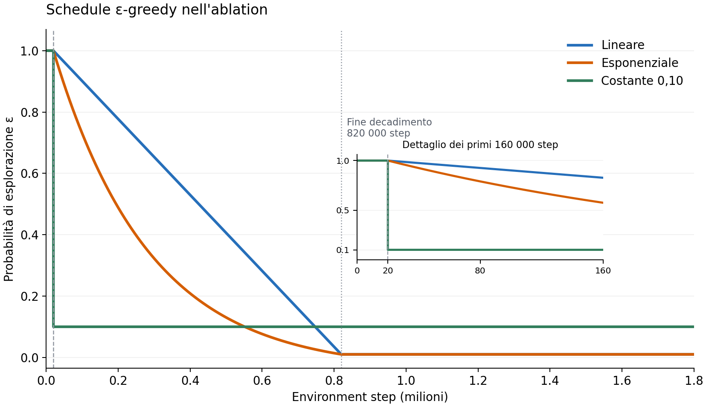

*Confronto delle schedule $\varepsilon(t)$ usate nell'ablation. Il riquadro ingrandito evidenzia il warm-up e il passaggio a $\varepsilon=0.10$ della variante costante.*

Osserviamo che la schedule lineare dell'ablation non coincide esattamente con quella della baseline, perché in questo esperimento il decadimento parte dopo il warm-up iniziale di 20000 step. Nella baseline $\varepsilon$ comincia invece a diminuire già dal primo environment step e al termine del warm-up è quindi già leggermente inferiore a 1.

### 4.5 Reward shaping

Negli esperimenti di reward shaping viene modificato il segnale usato nel target TD

$$  
\widetilde r_t=  
r_t^{\mathrm{Atari}}+b_t  
$$

Il termine $b_t$ è un segnale di reward ausiliario associato ad eventi considerati potenzialmente utili al conseguimento dell'obiettivo finale (un bonus per allungare la durata degli scambi o per il contatto con la pallina). Rappresentano quindi un incentivo a comportamenti che ragionevolmente si associano all'abilità richiesta dal gioco.

Il replay buffer memorizza il reward modificato, mentre l'evaluation viene sempre effettuata senza shaping e utilizza esclusivamente il reward Atari originale descritto nella sezione 3. L'obiettivo è verificare se un segnale ausiliario faciliti l'apprendimento e produca una policy migliore sul compito originale, o viceversa possa in realtà distorcere l'obiettivo originale dimostrandosi deleterio. Per ottenere un quadro più ampio abbiamo effettuato il confronto utilizzando tre diverse scale di effetto del bonus.

#### 4.5.1 Rally shaping

In questa variante viene aggiunto un piccolo bonus positivo durante i passi del rally nei quali non viene segnato alcun punto, fino a un limite massimo per singolo rally.

| Intensità  | Bonus per step $b$ | Limite per rally $B_{\max}$ |
| ---------- | ------------------ | --------------------------- |
| Piccolo    | 0.0002             | 0.02                        |
| Moderato   | 0.001              | 0.10                        |
| Aggressivo | 0.005              | 0.50                        |

L'idea intuitiva è premiare la capacità dell'agente di mantenere lo scambio in corso. Per continuare il rally la racchetta deve infatti raggiungere ripetutamente la traiettoria della pallina. La durata dello scambio viene quindi utilizzata come un proxy dell'abilità di gioco.

Indicando con $C_t$ il bonus già accumulato nel rally corrente, nei passi non terminali con reward Atari nullo il bonus è

$$  
b_t=  
\min\left(  
b,  
B_{\max}-C_t  
\right)  
$$
finché il cap non è raggiunto, negli altri passi $b_t=0$. Il reward utilizzato per l'ottimizzazione è quindi

$$  
\widetilde r_t=  
r_t^{\mathrm{Atari}}+b_t  
$$

Per un rally di $L$ passi premiabili, il bonus totale non scontato è

$$  
B(L)=\min(bL,B_{\max})  
$$

In tutte le configurazioni vale $B_{\max}/b=100$, cambia quindi l'intensità del segnale, mentre resta uguale il numero di passi necessari per saturare il bonus. Poichè il bonus favorisce la continuità dello scambio, ma non premia direttamente la vittoria del punto, se troppo intenso, ci si aspetta che possa modificare la policy in modo non perfettamente allineato con il reward Atari finale, come già accennato.

#### 4.5.2 Potential-Based Reward Shaping

Il PBRS fa riferimento al lavoro fondamentale di Ng, Harada e Russell [3] dove è formulato in generale per Markov Decision Process e stabilisce quali trasformazioni del reward permettono di introdurre segnali di shaping senza modificare la policy ottima. Nel nostro esperimento applichiamo questo principio al problema di controllo Atari definendo il potenziale

  

$$\Phi(s) = \begin{cases} \kappa \left( 1 - \dfrac{\vert{}\widehat{y}_b(s) - \widehat{y}_p(s)\vert{}}{H - 1} \right) & \text{se pallina e racchetta sono rilevate} \\ 0 & \text{altrimenti} \end{cases}$$

Nell'equazione $\widehat{y}_b(s)$ indica la coordinata verticale stimata della pallina nello stato $s$, $\widehat{y}_p(s)$ la coordinata verticale stimata della racchetta controllata e $\vert{}\widehat{y}_b(s) - \widehat{y}_p(s)\vert{}$ il loro disallineamento verticale. Il termine $H - 1$, con $H$ altezza dell'immagine processata, normalizza questa distanza in modo da renderla adimensionale. Il coefficiente $\kappa$ controlla infine l'intensità complessiva del potenziale. Se il detector[^2] non riesce a identificare entrambe le entità, il potenziale viene posto a zero. 

  

Si osservi che il valore del potenziale è maggiore quando pallina e racchetta risultano meglio allineate lungo l'asse verticale. L'idea è quindi premiare le transizioni che portano l'agente verso stati geometricamente favorevoli per intercettare la pallina.

  

Il reward ausiliario è definito come

  

$$b_t = \gamma \Phi(s_{t+1}) - \Phi(s_t)$$

valutato con $\kappa \in \{0.02, 0.10, 0.50\}$

  

La forma _potential-based_ è importante perché la trasformazione proposta da Ng, Harada e Russell [3],

  

$$F(s_t, s_{t+1}) = \gamma \Phi(s_{t+1}) - \Phi(s_t)$$

preserva l'ordinamento delle azioni sotto le ipotesi del teorema di policy invariance. Considerando il ritorno scontato con reward modificato

  

$$G_t' = \sum_{k=0}^{T-t-1} \gamma^k \left[ r_{t+k} + \gamma \Phi(s_{t+k+1}) - \Phi(s_{t+k}) \right]$$

i termini intermedi del potenziale si cancellano telescopicamente e si ottiene

  

$$G_t' = G_t - \Phi(s_t) + \gamma^{T-t}\Phi(s_T)$$

il potenziale dello stato terminale (`terminated=True`) viene posto a zero e quindi

  

$$G_t' = G_t - \Phi(s_t)$$

da cui condizionando entrambi i membri allo stesso stato e alla stessa azione iniziali e prendendo l'aspettativa lungo le traiettorie generate da una policy $\pi$ otteniamo

$$Q_\pi'(s,a)=\mathbb{E}_\pi[G_t'\mid s_t=s,a_t=a]=\mathbb{E}_\pi[G_t\mid s_t=s,a_t=a]-\Phi(s)$$

ossia

  

$$Q_\pi'(s, a) = Q_\pi(s, a) - \Phi(s)$$

Poiché per uno stato fissato il termine $-\Phi(s)$ è uguale per tutte le azioni, massimizzando per $a$

  

$$\arg\max_a Q_\pi'(s, a) = \arg\max_a Q_\pi(s, a)$$

e l'ordinamento delle azioni rimane invariato [3]. 
  

La garanzia formale di _policy invariance_ è formulata per una funzione potenziale dello stato Markoviano dell'MDP.
Non vi è alcuna garanzia formale che l'osservazione costituita dallo stack di frame rappresenti uno stato markoviano completo. L'ambiente reale è in realtà un POMDP nel quale la fisica interna della console non è del tutto catturata da quattro frame e il detector euristico può fallire o restituire letture rumorose. Di conseguenza, risulta particolarmente interessante studiare in che misura la validità del teorema si preservino empiricamente nel nostro caso concreto, caratterizzato da approssimazione neurale e osservazioni visive imperfette.

#### 4.5.3 Contact reward

Il bonus di contatto usa un detector euristico [^1] per identificare un'inversione della velocità orizzontale della pallina in prossimità della racchetta controllata. Tale evento viene quindi interpretato come indicazione di un'intercettazione riuscita. 

Il bonus è

$$  
b_t=\kappa I_t  
\qquad  
I_t\in{0,1}  
$$

dove $I_t=1$ quando viene rilevato un contatto e $I_t=0$ altrimenti. Il reward usato nel training è quindi

$$  
\widetilde r_t=  
r_t^{\mathrm{Atari}}+\kappa I_t  
$$

Viene applicato un cooldown di tre step per evitare di contare più volte lo stesso rimbalzo. Sono confrontati anche in questo caso

$$  
\kappa\in{0.02,0.10,0.50}  
$$

A differenza del reward Atari, che arriva soltanto alla conclusione del punto, questo bonus prova quindi a fornire un segnale positivo immediato quando l'agente compie un'azione che mantiene in vita lo scambio.

Le diagnostiche di questa sezione sono state calcolate sulle tre run Vanilla DQN originarie con training seed $\{1,2,3\}$. Le tre reti vengono valutate sullo stesso probe di 3000 transizioni, ottenuto da 12000 step complessivi e composto da 1000 transizioni per seed. Poiché la nuova replica seed 42 non è stata sottoposta allo stesso probe ma è successiva, queste analisi restano diagnostiche qualitative delle run storiche e non entrano nel confronto quantitativo primario, che usa i seed $\{42,2,3\}$.

Sul probe vengono analizzati:

- distribuzione del TD error
    
- $Q(s,\mathrm{NOOP})$, $Q(s,\mathrm{UP})$, $Q(s,\mathrm{DOWN})$ (stime del ritorno futuro per ciascuna azione nello stato $s$)
    
- action gap (scarto tra il maggiore e il secondo maggiore Q-value, che indica quanto è netta la preferenza stimata) cioè
    

$$  
\Delta Q(s)=  
Q_{(1)}(s)-Q_{(2)}(s)  
$$

dove $Q_{(1)}$ e $Q_{(2)}$ sono rispettivamente il maggiore e il secondo maggiore Q-value nello stato.

- heatmap della policy greedy proiettata sulla posizione orizzontale della pallina, sul disallineamento verticale pallina-racchetta e sul verso del moto orizzontale
    

Il detector geometrico è usato soltanto per la visualizzazione e non partecipa al training.

## 5. Risultati e discussione

### 5.1 Vanilla DQN e Double DQN

I risultati finali (multi-seed) sono riportati nella seguente tabella

| Modello | Return finale medio $\pm$ std tra seed |
| --- | ---: |
| Vanilla DQN | $12.77\pm2.05$ |
| Double DQN | $\mathbf{15.88\pm1.93}$ |

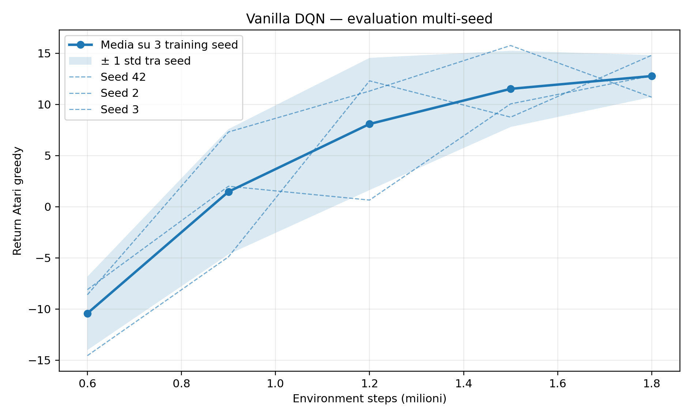

*Figura 1 — Vanilla DQN: return Atari greedy ai checkpoint. La linea spessa è la media sui tre seed, la banda è $\pm1$ deviazione standard campionaria tra seed e le linee sottili rappresentano le singole repliche.*

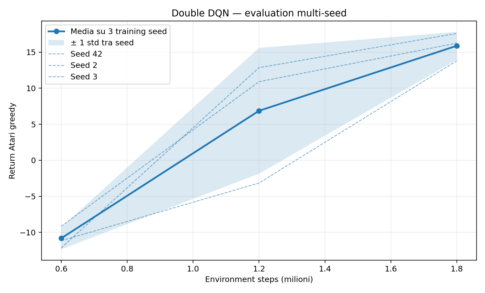

*Figura 2 — Double DQN: stesso protocollo di aggregazione della baseline.*

A parità di budget, Double DQN termina quindi 3.12 punti sopra Vanilla DQN in media. Il confronto è paired seed-by-seed al checkpoint finale:

| Training seed | Vanilla DQN | Double DQN | $\Delta$ DDQN $-$ DQN |
| ---: | ---: | ---: | ---: |
| 42 | 12.80 | 17.60 | +4.80 |
| 2 | 14.80 | 16.25 | +1.45 |
| 3 | 10.70 | 13.80 | +3.10 |

La differenza paired media è quindi $+3.12$ punti, con deviazione standard campionaria $1.68$ tra i tre delta.

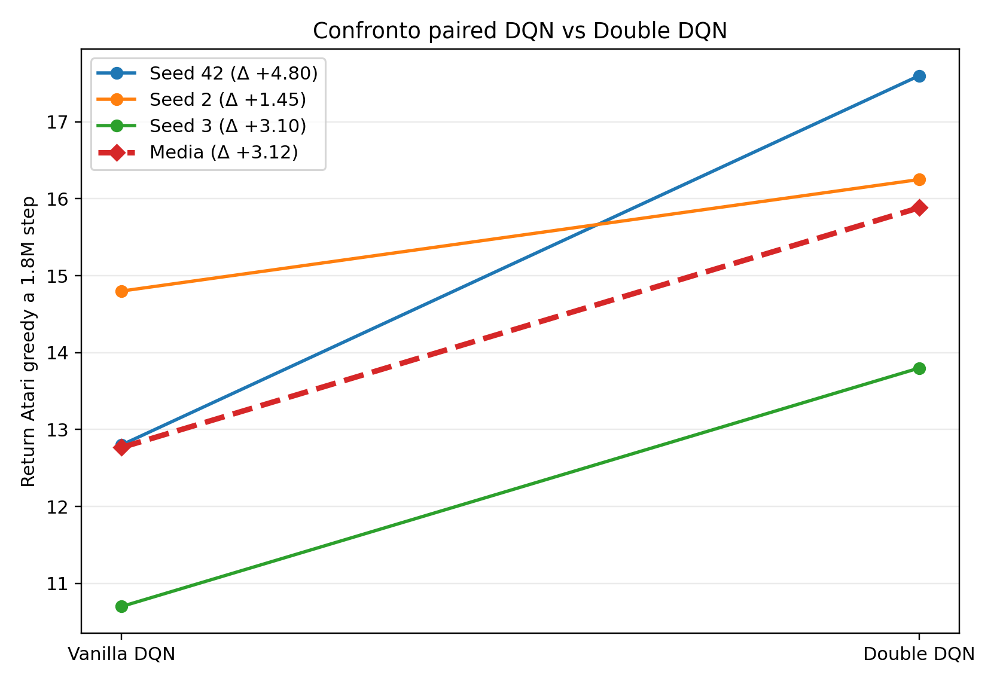

*Figura 3 — Confronto paired a 1.8M step: ogni linea collega Vanilla DQN e Double DQN addestrate con lo stesso training seed. La linea tratteggiata mostra la media sui tre seed.*

Con tre soli training seed questo risultato non può essere ovviamente interpretato come prova di superiorità statistica. Si osserva inoltre che nel nostro campione Double DQN presenta una forte variabilità al checkpoint di 1.2M step ($6.87\pm8.73$), dovuta soprattutto alla replica seed 3, prima di convergere verso prestazioni finali più consistenti.

La diagnostica disponibile di loss e target gap proviene dalle tre run Double DQN storiche con training seed $\{1,2,3\}$ e non include la nuova replica seed 42. viene quindi mantenuta come analisi qualitativa, separata dal confronto quantitativo primario.

In queste run storiche il target gap aggregato diminuisce soprattutto nella fase iniziale del training e successivamente resta piccolo ma positivo. Ciò indica che, procedendo con l'apprendimento, la differenza locale tra il bootstrap prodotto dal massimo della target network e quello ottenuto con la selezione Double DQN tende a ridursi, senza però annullarsi completamente.

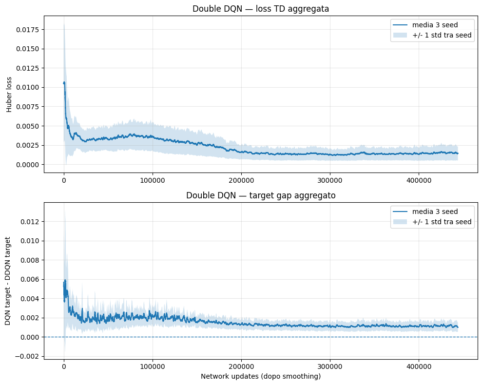

*Figura 4 — Andamento della loss e del target gap nelle tre run Double DQN storiche con seed $\{1,2,3\}$. Il target gap è una diagnostica del disaccoppiamento tra selezione e valutazione e non una misura diretta dell'errore rispetto a $Q^\ast$.*
### 5.2 Visualizzazioni e diagnostiche

Le principali statistiche calcolate sul probe comune per le run Vanilla DQN storiche con seed $\{1,2,3\}$ sono riportate nella tabella seguente:

| **Seed** | TD MAE  | $p_{95}(∣δ∣)$ | Media $\, max_{a}​Q(s,a)$ | **Action gap medio** |
| -------- | ------- | ------------- | ------------------------- | -------------------- |
| 1        | 0.05218 | 0.16848       | 0.60962                   | 0.03102              |
| 2        | 0.05248 | 0.16693       | 0.67454                   | 0.03038              |
| 3        | 0.04825 | 0.15618       | 0.65820                   | 0.03030              |

Le distribuzioni del TD error sono molto simili tra i tre seed e risultano concentrate vicino allo zero sul probe comune. Il TD MAE è la media degli errori TD assoluti, $N^{-1}\sum_{i=1}^{N}|\delta_i|$, calcolati sulle $N$ transizioni del probe, rimane nell'intervallo circa $0.048$--$0.052$.
Il 95-esimo percentile $p_{95}(|\delta|)$ è circa $0.156$--$0.168$, cioè circa il 95% delle transizioni considerate presenta un errore assoluto non superiore a tale soglia, mentre la coda restante può avere errori maggiori. Queste sono misure dello scarto locale rispetto ai target TD della rete, non dell'errore rispetto al valore ottimo né una garanzia sulla qualità della policy.
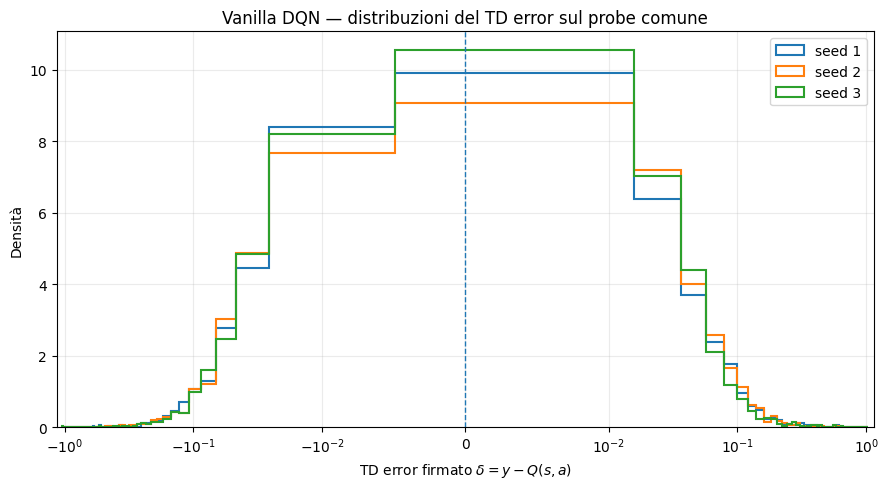

*Figura 5 — Distribuzione del TD error sul probe comune per le tre run Vanilla DQN storiche con seed $\{1,2,3\}$.*

Anche la scala dei Q-value è simile tra le tre reti. L'action gap medio è circa $0.03$ per tutti i seed, indicando che negli stati analizzati la migliore e la seconda migliore azione sono spesso relativamente vicine in valore. 

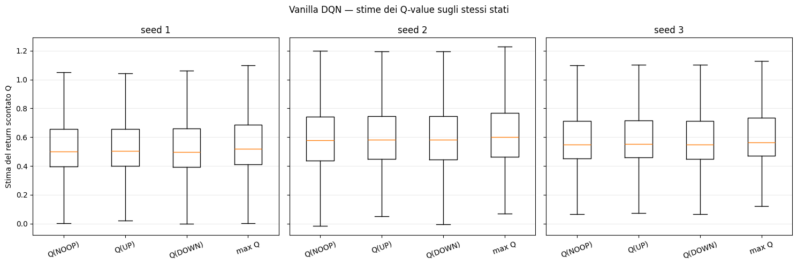

*Figura 6 — Distribuzione delle stime $Q(s,a)$ sullo stesso probe per le tre azioni disponibili, nelle run storiche con seed $\{1,2,3\}$.*

Le policy heatmap mostrano una struttura dipendente dalla geometria pallina-racchetta e dalla direzione del moto della pallina. Il detector geometrico usato per la sola visualizzazione su frame RGB grezzi, accetta una transizione soltanto se individua esattamente una pallina e una racchetta in regioni prefissate con i propri criteri di colore, luminosità e dimensione. La copertura congiunta nel rollout diagnostico è circa il 62%. Frame di transizione, oggetti fuori dalle regioni cercate o pixel che non soddisfano le soglie sono possibili cause di esclusione, non abbiamo misurato quanta parte del 38% mancante sia attribuibile a ciascuna causa. Le heatmap sono quindi costruite soltanto sulla porzione di stati per cui queste quantità geometriche sono disponibili e rappresentano una proiezione parziale, potenzialmente selettiva, della policy piuttosto che una descrizione completa.

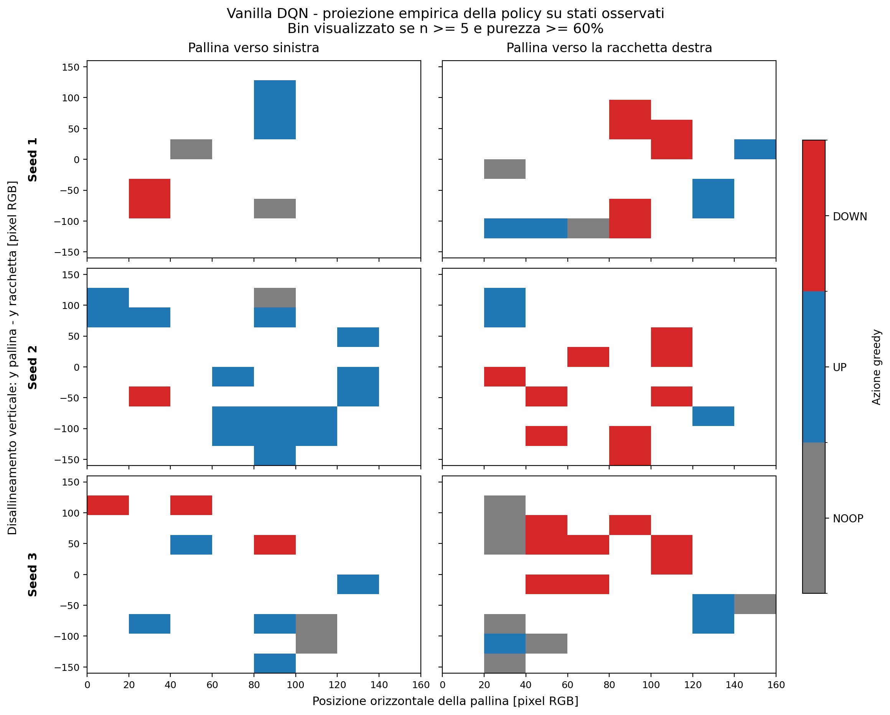

*Figura 7 — Proiezione empirica della policy greedy per le run storiche con seed $\{1,2,3\}$. I pannelli sono separati per training seed e verso orizzontale della pallina; vengono mostrati soltanto bin con almeno 5 osservazioni e purezza almeno 60%.*

### 5.3 Confronto schedule di esplorazione

Nella tabella successiva sono raccolti i risultati finali sui tre training seed utilizzati.

| Schedule      | 1° seed | 2° seed | 3° seed | Media $\pm$ std tra seed |
| ------------- | ------- | ------- | ------- | ------------------------ |
| Lineare       | 12.80   | 14.70   | 6.95    | $11.48\pm4.04$           |
| Esponenziale  | 17.10   | 13.75   | 13.80   | $\mathbf{14.88\pm1.92}$  |
| Costante 0.10 | -2.20   | 14.20   | 13.10   | $8.37\pm9.17$            |

La schedule esponenziale combina il return finale medio più alto con una dispersione inferiore alle altre due strategie. La schedule costante non fallisce sistematicamente ma due repliche raggiungono circa 13--14 punti, mentre una termina a -2.20. Il risultato più evidente sembra quindi la sua forte sensibilità alla traiettoria di training.
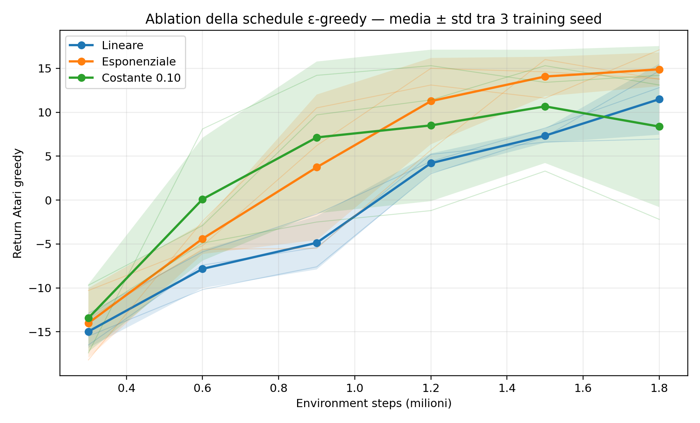

*Figura 8 — Ablation $\varepsilon$-greedy: media e deviazione standard tra tre training seed ai checkpoint di evaluation. Le curve sottili mostrano le singole repliche.*

### 5.4 Reward di durata del rally

| Intensità  | 1° seed | 2° seed | 3° seed | Media $\pm$ std tra seed |
| ---------- | ------- | ------- | ------- | ------------------------ |
| Piccolo    | 15.35   | 12.15   | 13.20   | $13.57\pm1.63$           |
| Moderato   | 16.10   | 15.15   | 14.30   | $\mathbf{15.18\pm0.90}$  |
| Aggressivo | 16.70   | -21.00  | 7.50    | $1.07\pm19.66$           |

La configurazione moderata è la più stabile e ottiene la migliore media finale. La configurazione aggressiva mostra invece una dispersione molto elevata con una replica che raggiunge 16.70, una che collassa a -21.00 e la terza che termina a 7.50.

Negli ultimi 100 episodi di training il contributo medio del bonus per episodio cresce con l'intensità, risultando circa 0.60, 2.63 e 10.75 rispettivamente. Un maggiore reward ausiliario non si traduce quindi automaticamente in una migliore policy Atari confermando come oltre una certa scala, l'incentivo addizionale può modificare sensibilmente la dinamica di apprendimento e aumentarne l'instabilità.
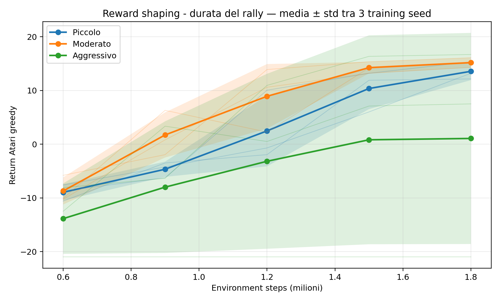

*Figura 9 — Rally shaping: return Atari greedy aggregato sui tre training seed. La banda rappresenta la deviazione standard tra training indipendenti e non la variabilità episodica della singola rete.*

### 5.5 Potential-Based Reward Shaping

I risultati finali sono:

| $\kappa$ | 1° seed | 2° seed | 3° seed | Media $\pm$ std tra seed |
| -------- | ------- | ------- | -------- | ------------------------ |
| 0.02     | 12.95   | 14.60   | 15.45    | $14.33\pm1.27$           |
| 0.10     | 16.05   | 13.45   | 15.75    | $15.08\pm1.42$           |
| 0.50     | 15.50   | 16.65   | 17.10    | $\mathbf{16.42\pm0.83}$  |

Poiché l'interpretazione dipende anche dalla dinamica temporale e non soltanto dal checkpoint finale, la tabella seguente riporta le medie e le deviazioni standard tra seed ai principali checkpoint.

|Step|$\kappa=0.02$|$\kappa=0.10$|$\kappa=0.50$|
|---|---|---|---|
|600k|$-9.78\pm3.30$|$-9.18\pm1.15$|$-11.67\pm2.73$|
|900k|$-1.18\pm0.08$|$-2.05\pm3.68$|$-3.63\pm2.95$|
|1.2M|$10.10\pm4.16$|$11.92\pm1.98$|$-0.42\pm7.27$|
|1.5M|$13.73\pm1.19$|$11.38\pm0.35$|$13.70\pm1.06$|
|1.8M|$14.33\pm1.27$|$15.08\pm1.42$|$\mathbf{16.42\pm0.83}$|

La scala $\kappa=0.50$ produce il miglior risultato finale della famiglia e anche la minore dispersione finale, ma non accelera uniformemente il training. A 1.2M step la sua media è ancora $-0.42\pm7.27$, nettamente inferiore alle altre due configurazioni, mentre a 1.5M step recupera a $13.70\pm1.06$ e termina infine a $16.42\pm0.83$.

Il comportamento osservato suggerisce quindi un apprendimento più lento nella fase intermedia seguito da una convergenza finale più consistente. Questo è un esempio del motivo per cui il solo risultato finale non è sufficiente per descrivere la dinamica di una configurazione.

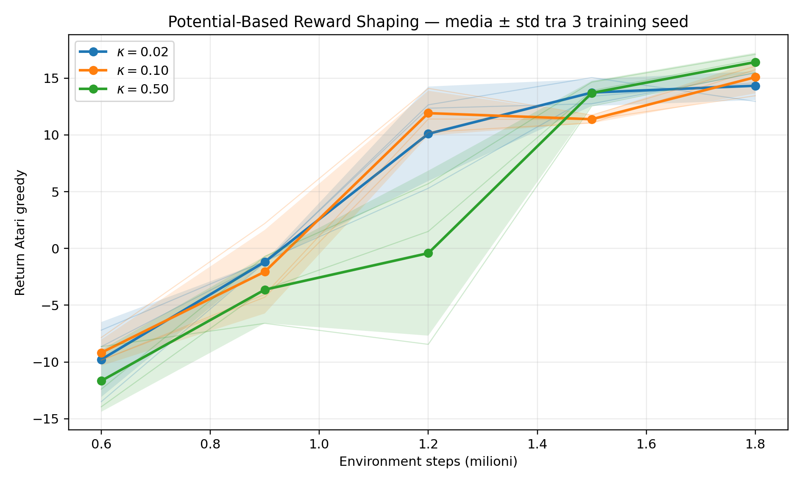

*Figura 10 — PBRS: return Atari greedy aggregato sui training seed per le tre intensità del potenziale.*

### 5.6 Reward di contatto

| Bonus $\kappa$ | 1° seed | 2° seed | 3° seed | Media $\pm$ std tra seed |
| -------------- | ------- | ------- | ------- | ------------------------ |
| 0.02           | 8.20    | 13.95   | 14.55   | $12.23\pm3.51$           |
| 0.10           | 16.25   | 15.15   | 12.30   | $\mathbf{14.57\pm2.04}$  |
| 0.50           | 6.95    | -21.00  | 6.80    | $-2.42\pm16.09$          |

La configurazione moderata $\kappa=0.10$ è la più efficace della famiglia nel campione osservato. La configurazione aggressiva è invece estremamente instabile con due repliche che terminano intorno a 7 punti, mentre una rimane a -21 per tutti i checkpoint da 600k a 1.8M step.

Il risultato chiaramente non dimostra che un bonus elevato fallisca necessariamente, ma suggerisce che esso aumenta fortemente il rischio di una traiettoria di training degenerata. 
Da questi dati non è possibile stabilire se il problema verrebbe risolto semplicemente aumentando il numero di step e rallentando il decadimento di $\varepsilon$su un'orizzonte più lungo, è un ipotesi plausibile, ma richiederebbe un esperimento dedicato.

Osserviamo che il detector di contatto rimane molto sparso. Negli ultimi 100 episodi il numero medio di contatti rilevati è circa 0.37, 0.49 e 0.76 per $c=0.02$, $0.10$ e $0.50$ rispettivamente, con forte dispersione per la configurazione aggressiva. In pratica ciò significa che il bonus positivo viene attivato in pochissime transizioni rispetto al numero totale di step. Un bonus così raro dà all’agente poche indicazioni aggiuntive sui contatti utili. Inoltre, una mancata rilevazione o un falso positivo pesa proporzionalmente di più sul segnale.
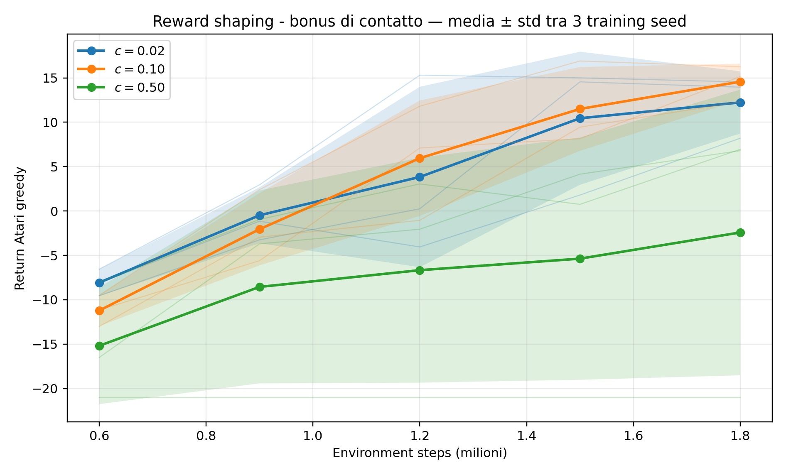

*Figura 11 — Contact reward: curva di evaluation multi-seed. L'elevata dispersione per $c=0.50$ è dovuta in particolare alla replica che rimane a -21.*
### 5.7 Confronto finale

La tabella seguente riassume i risultati finali a 1.8M step. Tutte le righe del confronto primario sono aggregate sugli stessi training seed $\{42,2,3\}$.

| Famiglia | Configurazione | Return finale medio $\pm$ std tra seed |
| -------- | -------------- | -------------------------------------- |
| Baseline | Vanilla DQN    | $12.77\pm2.05$                         |
| Target   | Double DQN     | $15.88\pm1.93$                         |
| Epsilon  | lineare        | $11.48\pm4.04$                         |
| Epsilon  | esponenziale   | $14.88\pm1.92$                         |
| Epsilon  | costante 0.10  | $8.37\pm9.17$                          |
| Rally    | piccolo        | $13.57\pm1.63$                         |
| Rally    | moderato       | $15.18\pm0.90$                         |
| Rally    | aggressivo     | $1.07\pm19.66$                         |
| PBRS     | $\kappa=0.02$  | $14.33\pm1.27$                         |
| PBRS     | $\kappa=0.10$  | $15.08\pm1.42$                         |
| PBRS     | $\kappa=0.50$  | $\mathbf{16.42\pm0.83}$                |
| Contact  | $c=0.02$       | $12.23\pm3.51$                         |
| Contact  | $c=0.10$       | $14.57\pm2.04$                         |
| Contact  | $c=0.50$       | $-2.42\pm16.09$                        |
| Umano    | //             | 9.3                                    |
Come riferimento, un agente che sceglie casualmente (con probabilità uniforme) tra le tre azioni ottiene un return medio di $-20.40\pm0.86$ su 20 episodi di evaluation.
Come benchmark umano è stato usato il valore umano di $9.3$ riportato da Mnih et al. [1] che è il riferimento di letteratura. 

Considerato il limite statistico di sole tre repliche per configurazione, piccole differenze non possono essere interpretate come prove conclusive e potrebbero in parte dipendere dalla variabilità del training. I risultati supportano comunque tre osservazioni finali.

In primo luogo, Double DQN ottiene una media finale superiore alla Vanilla DQN e una dispersione finale inferiore. Una seconda evidenza sperimentale è che l'esplorazione esponenziale risulta la schedule più consistente tra quelle considerate, combinando la migliore media finale con una variabilità relativamente contenuta. 
Infine, la scala del reward shaping appare cruciale ma l'intensità migliore varia in base al reward considerato. Rally e Contact diventano molto instabili alle intensità più elevate, mentre PBRS mostra un comportamento differente e raggiunge il miglior risultato finale proprio con $\kappa=0.50$.

## 6. Conclusioni

Il progetto mostra, in linea con la letteratura, che una DQN convoluzionale può apprendere una policy efficace per Atari Pong entro 1.8 milioni di environment step e che modifiche al target TD, alla schedule di esplorazione e alla struttura del reward possono modificare sensibilmente il comportamento del training.

L'analisi multi-seed è risultata essenziale perché alcune conclusioni suggerite dalle singole run iniziali sono cambiate quando sono state aggiunte repliche indipendenti. In particolare, epsilon costante, rally aggressivo e contact aggressivo mostrano che una singola run può essere poco rappresentativa del comportamento medio dell'algoritmo.

### Limitazioni

Le principali limitazioni del seguente lavoro sono:

- **Numero ridotto di seed.** Tre training seed costituiscono un campione estremamente ridotto. Permettono di osservare l'instabilità di alcune configurazioni, ma non consentono stime precise della distribuzione delle prestazioni né conclusioni statistiche forti.
    
- **Copertura delle diagnostiche geometriche.** Il detector usato per le heatmap identifica contemporaneamente pallina e racchetta in circa il 62% delle transizioni del rollout diagnostico. In pratica, circa il 38% degli stati non può essere collocato nelle coordinate geometriche utilizzate per la visualizzazione e viene quindi escluso da quella specifica analisi. Le heatmap potrebbero pertanto essere influenzate da un bias di selezione e non rappresentano l'intera distribuzione degli stati visitati.
    
- **Sparsità del detector di contatto.** Gli eventi di contatto rilevati sono rari rispetto al numero totale di transizioni. Il reward ausiliario corrispondente è quindi poco denso ed errori di rilevazione, mancati contatti o falsi positivi possono influire in modo relativamente importante su un segnale poco frequente.
    
- **Budget computazionale.** Il limite di 1.8M environment step, le dimensioni del buffer e le altre scelte dei parametri sperimentali possono nascondere differenze che emergerebbero con training più lunghi. Il vincolo è stato imposto dal budget GPU disponibile negli ambienti utilizzati per gli esperimenti (Kaggle e Colab) e rappresenta quindi un compromesso tra il mantenimento di una base comune a tutti gli esperimenti ed il budget computazionale disponibile. I valori in questo lavoro definiscono un regime sperimentale specifico e configurazioni che appaiono lente o instabili entro tale budget potrebbero comportarsi diversamente con replay buffer più grandi e training più lunghi.
    

Sviluppi naturali includono l'aumento del numero di seed, test su altri giochi Atari, una ricerca più sistematica e ampia degli iperparametri di shaping, training più lunghi e l'approfondimento di detector o rappresentazioni dello stato più robusti per le analisi qualitative. Inoltre sono state esplorate soltanto tre famiglie di reward ausiliari e tre intensità per famiglia. In letteratura esistono altre possibilità, ad esempio potenziali basati su distanza o raggiungimento di sotto-obiettivi nell'ambito del PBRS [3], reward intrinseci basati sulla curiosità e sull'errore di predizione [5], oppure bonus di esplorazione derivati da pseudo-count dello stato [6]. Questi approcci potrebbero fornire un confronto più ampio ed arricchire ulteriormente il lavoro.

## 7. Informazioni addizionali

### 7.1 Uso dell'intelligenza artificiale

L'intelligenza artificiale è stata usata nella realizzazione del progetto, in particolare per la:

- ricerca preliminare e revisione della documentazione e della letteratura rilevante
    
- generazione, revisione e debugging dei notebook utilizzati negli esperimenti
    
- riorganizzazione modulare del codice dei notebook per il repository GitHub e generazione del README
    
- revisione grammaticale e stilistica della presente relazione e miglioramento grafico della presentazione powerpoint
    

## Fonti

[1] V. Mnih, K. Kavukcuoglu, D. Silver, et al., *Human-level control through deep reinforcement learning*, Nature, 518, 529–533, 2015 — https://doi.org/10.1038/nature14236

[2] H. van Hasselt, A. Guez, D. Silver, *Deep Reinforcement Learning with Double Q-learning*, Proceedings of the AAAI Conference on Artificial Intelligence, 30(1), 2016 — https://doi.org/10.1609/aaai.v30i1.10295

[3] A. Y. Ng, D. Harada, S. J. Russell, *Policy Invariance Under Reward Transformations: Theory and Application to Reward Shaping*, Proceedings of ICML, 1999 — https://people.eecs.berkeley.edu/~russell/papers/icml99-shaping.pdf

[4] Farama Foundation, *Gymnasium Documentation: Handling Time Limits / Termination and Truncation* — https://gymnasium.farama.org/tutorials/gymnasium_basics/handling_time_limits/

[5] D. Pathak, P. Agrawal, A. A. Efros, T. Darrell, *Curiosity-driven Exploration by Self-supervised Prediction*, Proceedings of ICML, 2017 — https://proceedings.mlr.press/v70/pathak17a.html

[6] M. G. Bellemare, S. Srinivasan, G. Ostrovski, T. Schaul, D. Saxton, R. Munos, *Unifying Count-Based Exploration and Intrinsic Motivation*, Advances in Neural Information Processing Systems, 2016 — https://proceedings.neurips.cc/paper/2016/hash/afda332245e2af431fb7b672a68b659d-Abstract.html

[7] V. Mnih, K. Kavukcuoglu, D. Silver, A. Graves, I. Antonoglou, D. Wierstra, M. Riedmiller, *Playing Atari with Deep Reinforcement Learning*, arXiv:1312.5602, 2013 — https://arxiv.org/abs/1312.5602

[8] Farama Foundation, *Gymnasium Atari / Pong and AtariPreprocessing documentation* — https://gymnasium.farama.org/environments/atari/pong/ and https://gymnasium.farama.org/api/wrappers/misc_wrappers/#gymnasium.wrappers.AtariPreprocessing

[9] PyTorch, *SmoothL1Loss documentation* — https://docs.pytorch.org/docs/stable/generated/torch.nn.SmoothL1Loss.html

[^1]: le posizioni della pallina sono stimate per differenza e contrasto nelle tre coppie consecutive degli ultimi quattro frame grayscale; la racchetta è cercata nell'ultimo frame. Un contatto candidato richiede che la pallina proceda prima verso destra (spostamento orizzontale almeno $0.5$ pixel), poi verso sinistra (al più $-0.5$), che il punto di svolta sia nella zona destra ($x\geq60$) e che la distanza verticale dalla racchetta non superi 14 pixel. Se una posizione non è rilevata il candidato viene scartato.

[^2]: Il detector confronta gli ultimi due frame in scala di grigi e cerca la racchetta nella zona destra e la pallina nella zona centrale, usando la differenza tra i frame per riconoscere il movimento.

[^3]: 

[^4]:  nell’ambiente `ALE/Pong-v5` usato nel progetto un episodio termina quando uno dei giocatori raggiunge 21 punti
